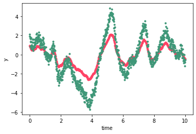

<h1 align="center">
  specgp
</h1>
<p align="center">
    <a href='https://specgp.readthedocs.io/en/latest/?badge=latest'>
        </a>
    <a href="https://travis-ci.com/github/tagordon/specgp">
        </a>
    <a href="https://github.com/tagordon/specgp/blob/master/LICENSE">
        </a>
    <a href="https://arxiv.org/abs/2007.05799">
        </a>
    </br>
    <a href="https://github.com/exoplanet-dev/exoplanet">
        </a>
    <a href="https://github.com/dfm/celerite">
        </a>
    <a href="https://github.com/pymc-devs/pymc3">
        </a>
</p>
<p>
    <em>specgp</em> enables 2D Gaussian process computations in <a href="https://github.com/exoplanet-dev/exoplanet.git"><em>exoplanet</em></a>. This is accomplished by a new kernel term which combines 
    a <em>celerite</em> term with a specification of the covariance for the second dimension. The 
    method     
</p>

<h2>
    installation
</h2>
<p>
    Installation is via pip:
    </br>
    <code>pip install specgp</code>
</p>
<h2>
    documentation
</h2>
<p>
    Documentation for <em>specgp</em> is available <a href="https://specgp.readthedocs.io">here</a>.
</p>
<h2>
    example
</h2>
<p>
    One straightforward application of *specgp* is modeling multiwavelength 
    stellar variability. While the tutorials at 
    <a href="https://specgp.readthedocs.io">specgp.readthedocs.io</a> cover 
    the details of optimizing a GP model and running MCMC on this kind 
    of data, here we present a simple demonstration of a multiwavelength 
    variability model that illustrates the most basic usage of *specgp*:
    We start by defining the covariance in the time dimension 
    using a *celerite* term:

</p>
    
```python
import numpy as np
import exoplanet as xo

term = xo.gp.terms.SHOTerm(log_S0=0.0, log_w0=1.0, log_Q=-np.log(np.sqrt(2)))
```

<p>
    In the simplest case we can model the wavelength dependence of a star's 
    variability as a simple scaling of the variability amplitude between bands 
    (see <a href="https://arxiv.org/abs/2007.05799">our paper</a> for details). 
    In this case we can construct the 2D kernel by passing the *celerite* term 
    along with a vector of scale factors for the wavelength-dependence to 
    the <code>KronTerm</code> constructor:
</p>
    
```python
import specgp as sgp

# scaling factors for a two band model. The 
# variability amplitude will scale by a factor 
# of two between the two bands.
alpha = [1, 2]
kernel = sgp.terms.KronTerm(term, alpha=alpha)
```
<p>
    Now we define the white noise component of the GP as 
    a 2D array containing the white noise variance for 
    each input coordinate:
</p>

```python
diag = np.array([0.001, 0.1])
diag = diag[:, None] * np.ones_like(t)
```

```
[[0.001 0.001 0.001 ... 0.001 0.001 0.001]
[0.1   0.1   0.1   ... 0.1   0.1   0.1  ]]
```

<p>
    Here the first row represents the white noise variance 
    at each time in the first band, and the second row represents 
    the variance at each time in the second band. We also need 
    to define a mean function for the GP. Here we define a 
    flat mean for the GP as another 2D array of zeros
    with the same structure as for the white noise:
</p>

```python
mu = sgp.means.KronMean(np.zeros((2, len(t))))
```

<p>
    Now we're ready to define the GP.
</p>

```python
gp = xo.gp.GP(x=t, kernel=kernel, diag=diag, mean=mu, J=2)
```

<p>
    Let's take a look at a sample from the GP:
</p>

```python
n = np.random.randn(2*len(t), 1)
y = gp.dot_l(n).eval()

pl.plot(t, y[::2], '.', color='#FE4365')
pl.plot(t, y[1::2], '.', color='#3F9778')
pl.xlabel("time")
pl.ylabel("y")
```



<p>
    Note that the ```dot_l``` function returns the 
    sample as a 1D vector with the coordinates all 
    mixed up. This happens because ```dot_l``` 
    operates directly on the Cholesky decomposition 
    of the Kronecker-structured covariance matrix. 
    For most use cases the user won't need to worry 
    about details like this, but it's pretty easy to 
    disentangle the output if you need to. The element 
    of the output corresponding to time ```i``` in band ```j``` 
    is located at the element ```(M-1)*i + j``` where ```M``` 
    is the number of bands.
</p>
